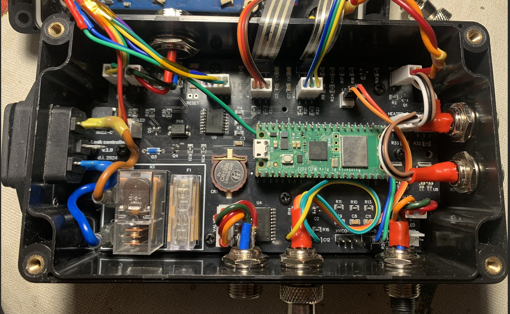
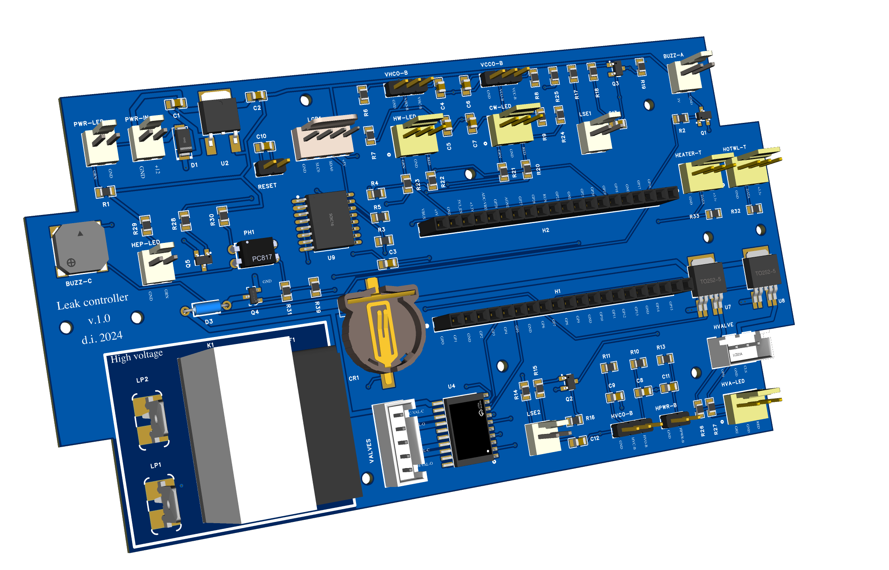
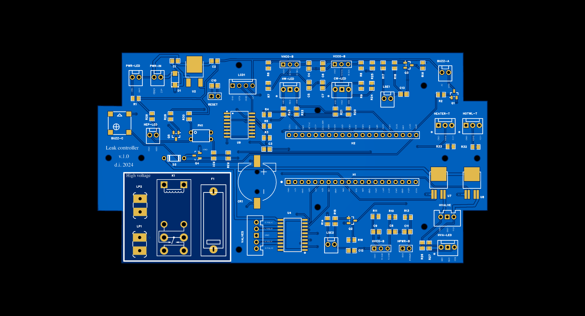
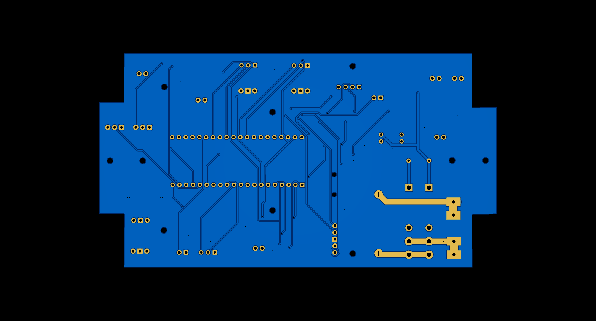
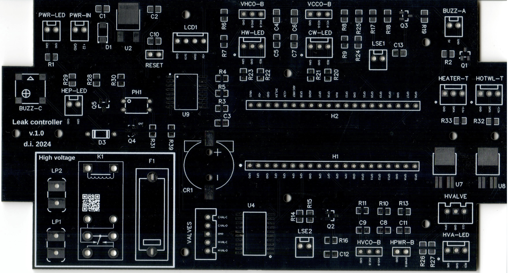
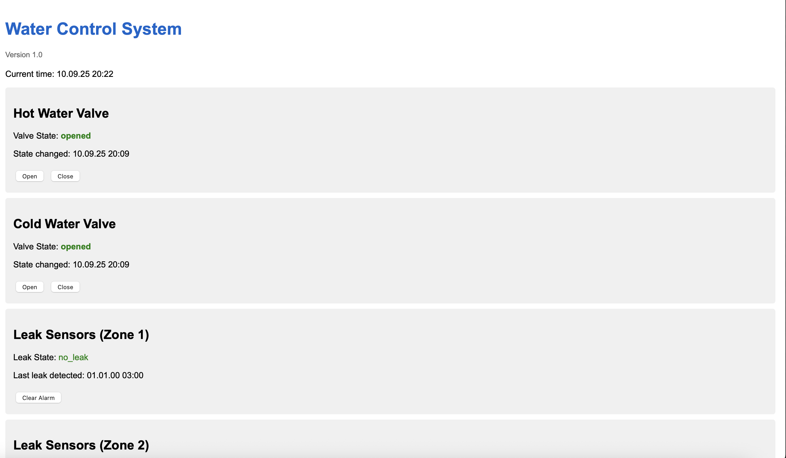
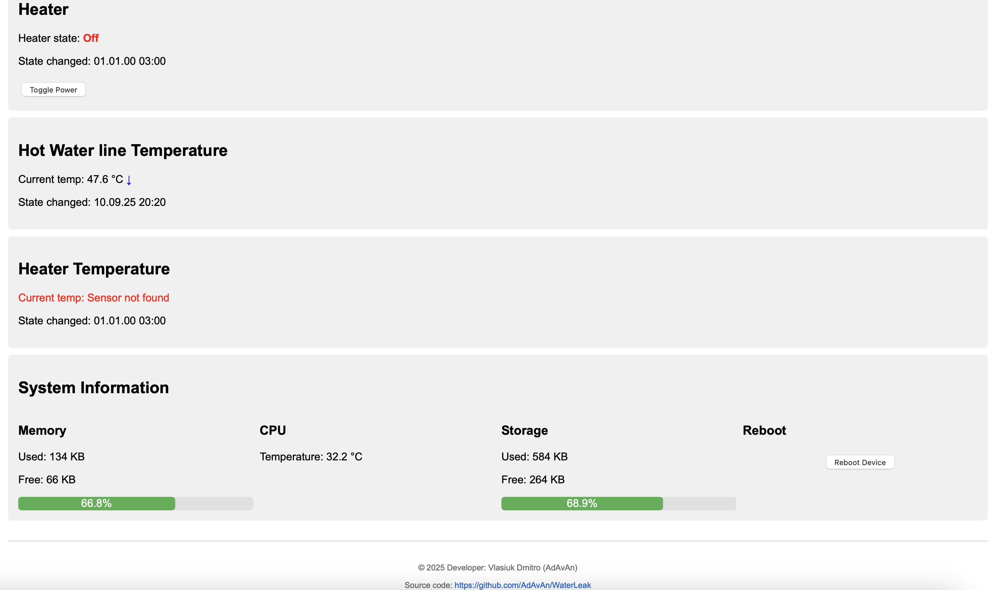

# WaterLeak Controller

**Water leak control system with automatic valve management**

A microcontroller-based system built on Raspberry Pi Pico W for monitoring water leaks, valve control, temperature monitoring, and remote management through a web interface.




*Finished WaterLeak Controller v1.0 device*

## 🚀 Key Features

- **Water leak monitoring** in 2 zones with automatic closure of water supply valves when triggered in any zone
- **Valve control** for hot and cold water (open/close) on demand (via buttons or web interface)
- **Temperature monitoring** of hot water and heater using DS18B20 sensors (display output on screen and web)
- **Heater management** with power state control (via buttons or web interface)
- **LCD display** with RGB backlighting for system status display. Different colours for various situations
- **Audio signals** for notifications and emergency situations
- **Web interface** for remote monitoring and control (simple interface without authentication)
- **RTC module** for precise timekeeping and scheduled events
- **WiFi connectivity** to existing network with automatic reconnection
- **State storage system** with saving to device non-volatile memory

## 🔮 Development Plans

1. **Add code for controlling a 3rd valve** that manages hot water supply based on central supply status. If hot water supply temperature is normal (45-60 degrees), the water heater is switched off and water is supplied from the central system. If central water supply temperature drops below 30°C, automatically switch off central supply and switch to heater using the 3rd valve. All necessary components are already included in the schematic, but the code has not been written.

2. **Heater control** based on temperature sensor feedback

3. **Automatic heater shutdown** during night hours for energy conservation

4. **Energy-saving mode** based on DS3231 chip alarm functionality, which has its own battery. Implementation: controller wake-up → sensor polling → shutdown

5. **Add authentication** to web interface

6. **Add 3rd contact (feedback)** to PCB for leak sensor to monitor connection status. This functionality was omitted during the design stage and became critical during installation, as the system cannot independently verify if the sensor is connected, preventing the controller from alerting about sensor cable breaks

## 📋 Requirements

### Hardware

- **Microcontroller:** Raspberry Pi Pico W
- **Display:** LCD1602 (WSLCD1602RGB 16x2 LCD with RGB backlighting, I2C)
- **RTC:** DS3231 (real-time clock module, I2C)
- **Temperature sensors:** DS18B20
- **Leak sensors:** simple contacts (2 units)
- **Valves:** motorised 12V valves (2 units), tested with Neptun Bugatti Pro 12V 1/2"

> **Note:** The system can operate without the LCD1602 display, temperature sensors, water heater, and WiFi network connection.

### Hardware Features

**Heater control** is performed through a relay managed by the Pi Pico via a transistor and PC817C optocoupler, providing isolation of the high-voltage module from the rest of the PCB. The board includes a fuse to prevent short circuits in the heater power supply circuit. The reverse side of the board has contacts that need to be soldered to ensure higher current capacity for the heater.

**Power supply:** The board requires external 12V power supply. This voltage powers the controller through a regulator and directly powers the valves.

**Indication:** The system includes LED indicators (optional for installation) for additional indication of actual voltage supply to valves. Whilst voltage is supplied to a valve, the indicator will illuminate.

**Valve control:**
- Voltage supply to valves is performed through an Infineon BTS721L1 chip, which includes protection systems and feedback contacts for convenience (feedback contacts are connected to the controller, but code for them has not been written)
- For heater valve control, two Infineon BTS452TATMA1 chips are used: one for closing, another for opening

**Water leak sensors** consist of two contacts (preferably implemented using stainless steel), connected to an S9018 transistor (with circuitry protecting against interference and false triggers). This arrangement provides a higher quality signal and protects the controller contact from direct connection to the sensor, thereby improving reliability. The transistors have good amplification coefficients, giving the sensors excellent sensitivity.

**RTC chip** receives and stores current time using an NTP server, which can be configured in the settings file. The chip contains its own CR-1220 battery to maintain current time. Additionally, the chip is connected to a separate pin 14 of the controller for interaction with the built-in alarm (refer to DS3231 datasheet), allowing additional tasks such as energy-saving mode by switching off the controller, timed heater shutdown mode, etc.

**Enclosure and mounting:** The PCB is designed for installation in an enclosure ([AliExpress link](https://www.aliexpress.com/item/1005007104359147.html)). Component sizes on the board are designed to allow soldering with a standard soldering iron, though using a hot air station is much more convenient. Sensors, buttons, and all external indicators connect to the board through HDR-M-2.54_1x3 connectors and others, but direct soldering is also possible.


### Software

- **Controller code** written in MicroPython version v1.19.1 or higher
- **Libraries:** All libraries are built into MicroPython; external drivers for display and RTC control are included in the repository and require no separate installation

#### MicroPython modules used:
```
- machine (Pin, I2C, PWM, RTC, ADC)
- network (WLAN)
- socket
- uasyncio
- ujson
- utime
- onewire
- ds18x20
- ntptime
```

## 🔌 Schematic Diagram


*WaterLeak Controller connection schematic*

## 🛠 Circuit Board


*3D view of WaterLeak Controller PCB*


2D view of WaterLeak Controller PCB*





*Printed circuit board*

## 📦 Installation and Configuration

### 1. MicroPython Preparation

1. Download the latest MicroPython version for Raspberry Pi Pico W
2. Flash the controller via USB in BOOTSEL mode
3. Connect to the device via UART or USB

### 2. Code Loading

1. Clone the repository:
```bash
git clone https://github.com/AdAvAn/WaterLeak.git
cd WaterLeak
```

2. Copy settings:
```bash
cp Resources/Settings_example.py Resources/Settings.py
```

3. Edit `Resources/Settings.py`:
```python
# WiFi settings
WIFI_SSID: str = 'YOUR_WIFI_SSID'
WIFI_PASSWORD: str = 'YOUR_WIFI_PASSWORD'

# Your time zone 
TIME_ZONE_OFFSET: int = 3  # UTC+3 for Ukraine
```

4. Upload all files to the device via IDE (Thonny, VSCode with extension, etc.)

### 3. First Start-up

1. Ensure all sensors are connected properly
2. Restart the device
3. The device will automatically:
   - Connect to WiFi
   - Synchronise time via NTP
   - Initialise all sensors
   - Start the web server

## 🌐 Web Interface

After successful WiFi connection, the system will be accessible via the device's IP address:

```
http://192.168.1.XXX/
```

#### Web interface:




## 📖 Project Structure

```
WaterLeak/
├── main.py                 # Main startup file
├── Buttons/               # Button control modules
├── Buzzers/               # Audio signal management
├── Heater/                # Heater control
├── Helpers/               # Utility functions
├── LCD/                   # Display management
├── Logging/               # Logging system
├── RTC/                   # Real-time clock module
├── Resources/             # Settings and resources
├── Sensors/               # Sensors (temperature, leaks)
├── State/                 # State system
├── Valves/                # Valve management
├── WebServer/             # Web server
└── docs/                  # Documentation and images
```

## 🔧 Pin Configuration

Main pins are configured in the `Resources/Settings.py` file:

```python
# I2C for display and RTC
SDA_PIN = 18
SCL_PIN = 19

# Control buttons
VHOB_PIN = 27    # Open hot water valve
VHCB_PIN = 26    # Close hot water valve
VCOB_PIN = 22    # Open cold water valve
VCCB_PIN = 21    # Close cold water valve
HOCB_PIN = 20    # Heater control

# Valves
OPEN_HOT_W_PIN = 0     # Hot water valve opening
CLOSE_HOT_W_PIN = 1    # Hot water valve closing
OPEN_COLD_W_PIN = 3    # Cold water valve opening
CLOSE_COLD_W_PIN = 4   # Cold water valve closing

# Temperature sensors (OneWire)
HWLT_SE1_PIN = 12      # Hot water temperature
HEATER_TEMP_PIN = 13   # Heater temperature

# Leak sensors
LEAK_ZONE1_PIN = 14    # Zone 1 sensor
LEAK_ZONE2_PIN = 15    # Zone 2 sensor

# Buzzers
BUZZ_CONTROL_PIN = 16  # Control signals
BUZZ_ALARM_PIN = 17    # Alarm signal

# Heater
POWER_HEATER_PIN = 11  # Heater power control

# RTC alarm signal
DSDTC_ALARM_PIN = 10
```

## 🚨 Safety and Emergency Modes

### Automatic leak response:
1. **Leak detection** → immediate closure of all valves
2. **Heater shutdown** to prevent overheating
3. **Audio signal** and display notification
4. **Web notification** of critical situation

### Protection functions:
- **WiFi status monitoring** with automatic reconnection
- **Memory monitoring** with forced garbage collection
- **Watchdog timer** for restart during critical errors
- **State backup** during write failures

### 📝 Licence

This project is distributed under the GNU General Public License v3.0.
See the [LICENSE](LICENSE) file for detailed information.

